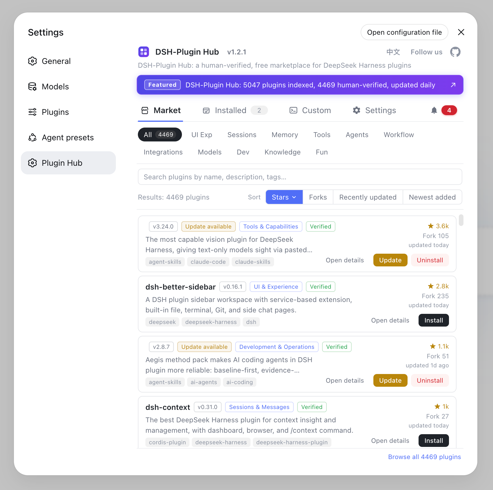
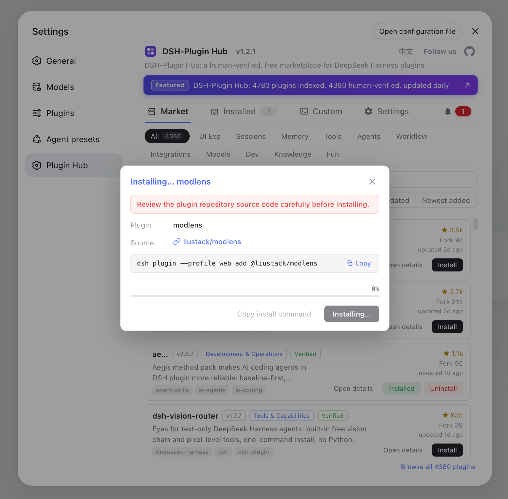
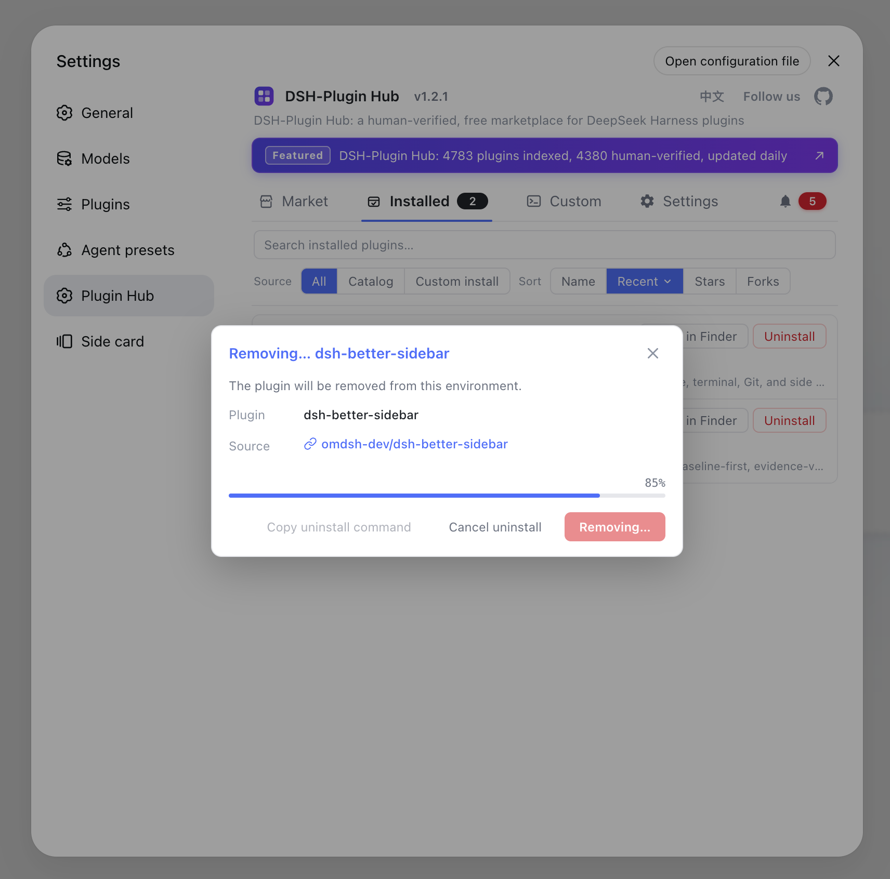
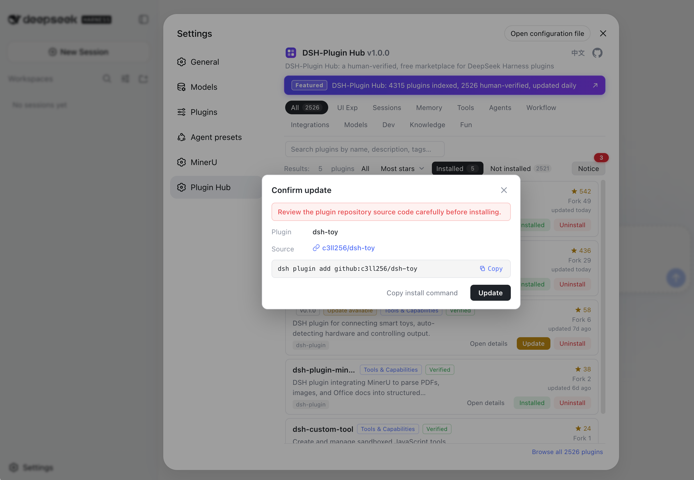
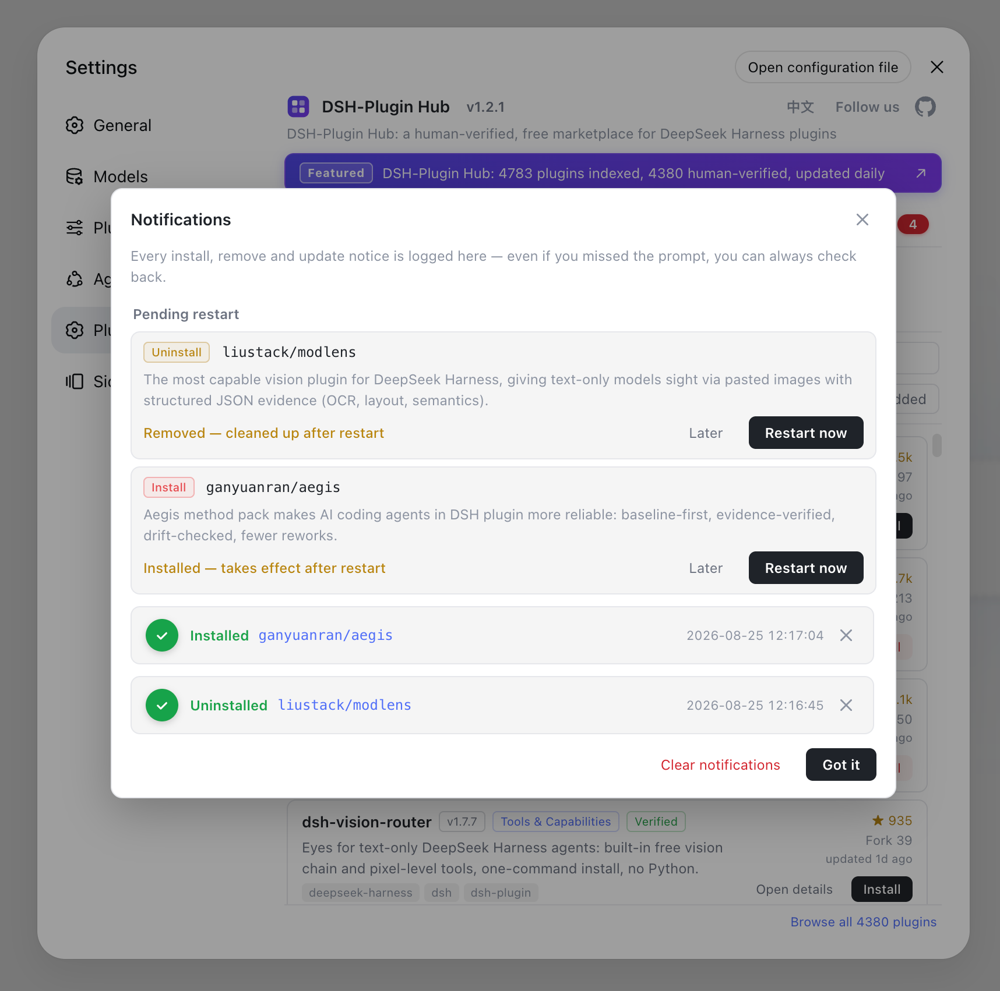
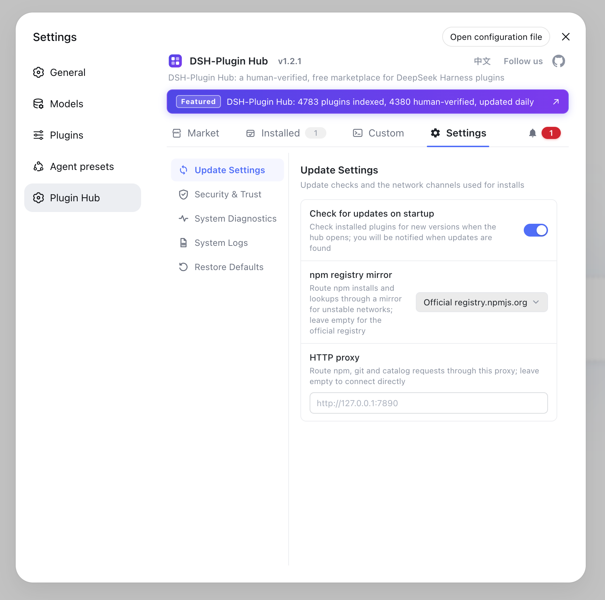
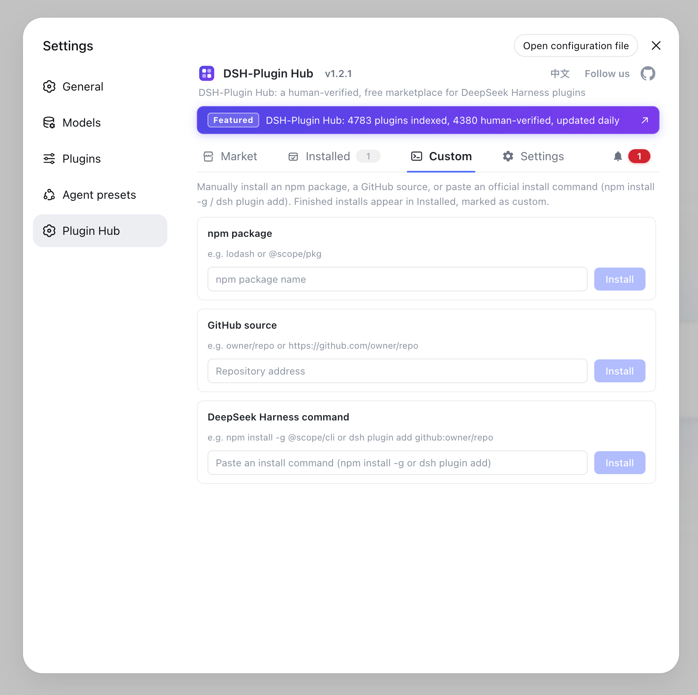

<div align="center">

<p>
  
</p>

# DSH-Plugin Hub for DeepSeek Harness

**A community plugin marketplace for DeepSeek Harness · 4,805 DSH plugins indexed · 4,401 human-verified**

[](LICENSE)
[](https://www.npmjs.com/package/dsh-plugin)
[](https://github.com/dshplugin/dsh-plugin-hub/actions)
[](https://dsh-plugin.org/plugins/dshplugin/dsh-plugin-hub)
[](https://github.com/dshplugin/dsh-plugin-hub)
[](https://dsh-plugin.org)
[](https://github.com/topics/dsh-plugin)

[Website](https://dsh-plugin.org) · [Issues](https://github.com/dshplugin/dsh-plugin-hub/issues) · [Submit a Plugin](https://dsh-plugin.org/submit)

[简体中文](README.md) · **English**

</div>

---

## What is DSH-Plugin Hub

DSH-Plugin Hub is a **community plugin marketplace for DeepSeek Harness**: an open-source plugin built to the official plugin development spec. Installed under **Settings → Plugin Hub**, it lets you browse, search and install community plugins without leaving the app. This is an independent community project, not affiliated with DeepSeek Harness.

<p align="center">
  
</p>

## Plugin Hub Features

**One-click everything · fully visualized**

- **One-click install** — click and done: a serial background queue with live progress in the dialog, cancellable anytime; most plugins take effect on page refresh, no restart needed
- **One-click upgrade** — new versions are detected automatically; the card turns into "Update" and overwrite-installs in one click
- **One-click uninstall** — fully visualized with live progress; changes take effect immediately
- **Full trace** — every install / upgrade / uninstall, success or failure, is recorded in the notification center for later review

**Notification center**

- Live progress and cancel for running tasks, pending restarts, and full success / failure history in one place
- Failed installs can be filed as a GitHub Issue in one click; pending restarts offer "later" or "restart now"

**Rich catalog · human-curated**

- Indexes **4,805** community plugins, **4,401** of which are hand-verified, curated and released every day by [dsh-plugin.org](https://dsh-plugin.org)
- Covers UI & experience, sessions & messages, memory & context, tooling and more — browse by category or search straight to it
- Every plugin shows its verification status (verified), star / fork ratings, version and last-update time — fully sourced

**Bilingual · easy to filter**

- The UI follows your system language by default and switches manually anytime from the top-right; copy and plugin data switch together
- Sort by popularity / newest / earliest indexed, with bilingual descriptions and capability tags at a glance
- Filter by installed / not installed and search across names, descriptions and tags

**Always in sync · lightweight & private**

- Same data source as the website; the catalog updates automatically, no manual upgrade needed
- Browser-side only, no host dependencies, no telemetry, no data collection

## Feature Highlights

| One-click install | One-click uninstall |
| :---: | :---: |
|  |  |
| A serial background queue with live progress in the dialog, cancellable anytime | Fully visualized with live progress; changes take effect immediately |

| One-click update | Notification center |
| :---: | :---: |
|  |  |
| New versions detected automatically; the card turns into "Update" and overwrite-installs in one click | Running tasks, pending restarts and full success / failure history in one place; failed installs can be filed as a GitHub Issue in one click |

| Settings | Custom install |
| :---: | :---: |
|  |  |
| Update checks, npm mirror and proxy channel, command-line install toggles and log location — managed in one place | Install any npm package or GitHub source outside the catalog, or paste an official install command; finished installs are marked as custom |

## Website Overview

The hub's catalog is curated and published by [dsh-plugin.org](https://dsh-plugin.org) and stays in sync with the site; on the website you can also see plugin details, ratings and links back to their GitHub sources.

| Homepage | Browse by category |
| :---: | :---: |
|  |  |
| Same data source as the hub — human-verified, updated daily | Browse every indexed plugin by category, search straight to it |

## Why DSH-Plugin Hub

The DSH-Plugin Hub indexes **4,805** DeepSeek Harness plugins (DSH), **4,401** of which are hand-verified — updated daily, browse, search, download and install for free by category, fully sourced.

### Always Fresh

Newly released DSH plugins are indexed as soon as possible; descriptions, categories and compatibility status of existing plugins are refreshed on a regular basis. We keep tracking the DeepSeek Harness ecosystem so you always see the latest information.

### Human-Verified

Every DSH plugin is manually checked by a professional team — install commands, compatibility status (verified / unconfirmed) and target DSH version (dshTarget) are verified one by one, with capability categories labeled. Quality is guaranteed.

### Fully Sourced

Every DSH plugin links back to its GitHub source repository with stars, forks and last-update time; data is compiled from the DeepSeek Harness official site, official architecture docs and official repos — everything is traceable.

## Install DSH-Plugin Hub

Install from npm (recommended):

```bash
dsh plugin --profile web add dsh-plugin
```

The plugin is published to the npm registry as `dsh-plugin` — one command installs and it just works, no build step required.

Install from GitHub:

```bash
dsh plugin --profile web add git+https://github.com/dshplugin/dsh-plugin-hub.git
```

> **Note**: the browser bundle ships with the package, so installing from GitHub needs no build step or authorization — just restart `dsh web` and open Settings → Plugin Hub.

## Getting Started: browse & install in DeepSeek Harness

Restart `dsh web` after installing, then open **Settings → Plugin Hub** to browse and install plugins. The catalog is same-source and in sync with [dsh-plugin.org](https://dsh-plugin.org).

## Submit your DSH plugin

Publish your plugin to GitHub and add the `dsh-plugin` topic — it will be discovered and indexed automatically. Requirements and the submission flow are on the [Submit a Plugin](https://dsh-plugin.org/submit) page.

## Contributing

- **Add your plugin**: tag it with the `dsh-plugin` topic to be auto-discovered — start on the [Submit a Plugin](https://dsh-plugin.org/submit) page
- **Fix data / suggest features**: open an [Issue](https://github.com/dshplugin/dsh-plugin-hub/issues)
- **Contribute code**: fork the repo and send a Pull Request

## Related

- [dsh-plugin.org](https://dsh-plugin.org) — the plugin hub website, same data source
- [deepseek-ai/deepseek-harness](https://github.com/deepseek-ai/deepseek-harness) — DeepSeek Harness itself

## License

[MIT](LICENSE) © DSH-Plugin Hub contributors
