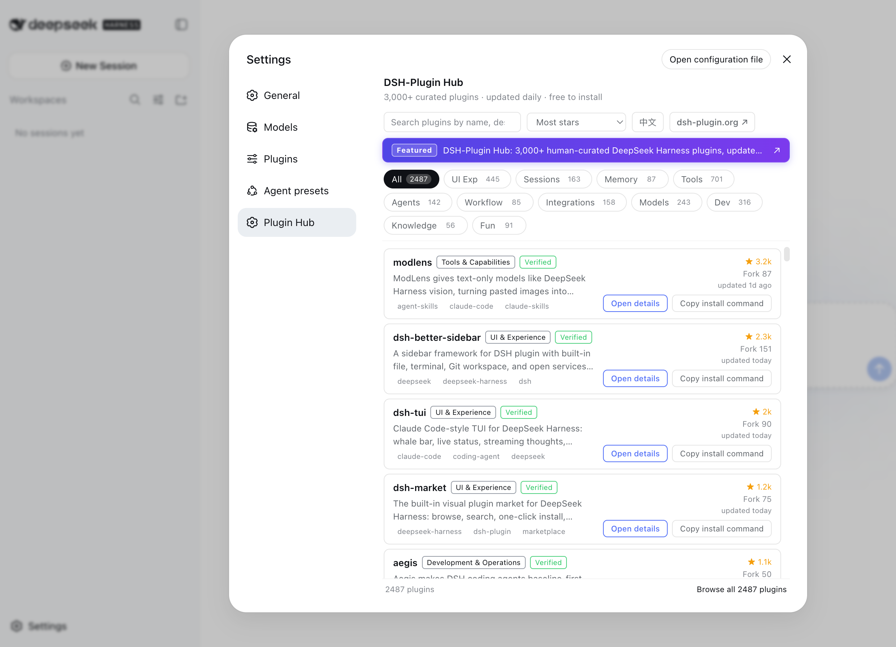

<div align="center">

<p>
  
</p>

# DSH-Plugin Hub for DeepSeek Harness

**DeepSeek Harness 社区插件市场：收录 4,261 个 DSH plugin，人工精选验证 2,487**

[](LICENSE)
[](https://github.com/dshplugin/dsh-plugin-hub)
[](https://dsh-plugin.org)
[](https://github.com/topics/dsh-plugin)

[官网](https://dsh-plugin.org) · [提交 Issue](https://github.com/dshplugin/dsh-plugin-hub/issues) · [提交插件](https://dsh-plugin.org/zh/submit)

**简体中文** · [English](README.en.md)

</div>

---

## 什么是 DSH-Plugin Hub

DSH-Plugin Hub 是 **DeepSeek Harness 社区插件市场**：一个遵循官方插件开发规范构建的开源插件，安装进「设置 → 插件中心」后，无需离开应用即可浏览、搜索并一键安装社区插件。本项目为独立社区项目，与 DeepSeek Harness 官方无隶属关系。

<p align="center">
  
</p>

## 插件中心特性

- **原生集成** — 嵌入 Harness「设置 → 插件中心」，界面中英双语，跟随系统语言
- **人工精选 · 每日更新** — 收录 **4,261** 个社区插件，其中 **2,487** 已人工精选验证，由 [dsh-plugin.org](https://dsh-plugin.org) 每日收录、人工审核并发布，来源可溯
- **实时同步** — 数据与官网同源，安装后自动获取最新目录，无需手动升级
- **一键直达** — 详情页即点即看，「在浏览器中打开」随时分享与收藏
- **轻量安全** — 仅浏览器端注入，无宿主服务依赖，无遥测、无隐私采集

## 为什么选择 DSH-Plugin Hub

DSH-Plugin 插件中心收录 **4,261** 个 DeepSeek Harness Plugin（DSH）插件，其中 **2,487** 已人工精选验证，每日更新，免费按分类浏览、搜索、下载与安装，来源可溯。

### 及时更新

新发布的 DSH plugin 会尽快收录进插件中心，已有插件的描述、分类与兼容状态也会定期刷新。专业团队持续跟进 DeepSeek Harness 生态动态，让你始终看到最新信息。

### 人工审核

每个 DSH plugin 都由专业的技术团队人工核查，逐项核对安装命令、兼容状态（verified / unconfirmed）与 DSH 目标版本（dshTarget），并标注能力分类，质量有保障。

### 来源可查

每个 DSH plugin 都链回其 GitHub 源码仓库，并展示 Star、Fork 与最近更新时间；本站数据整理自 DeepSeek Harness 官网、官方架构文档与官方仓库，看到的信息都有据可查。

## 安装 DSH-Plugin Hub

本地安装：

```bash
dsh plugin --profile web add dsh-plugin-hub
```

从 GitHub 安装：

```bash
dsh plugin --profile web add github:dshplugin/dsh-plugin-hub
```

> **提示**：从 GitHub 安装时，若 pnpm ≥ 10 提示 build script 未执行，请将 `dsh-plugin-hub` 加入 `pnpm.onlyBuiltDependencies`（或临时使用 `--allow-build`），否则浏览器端 bundle 不会构建。

## 快速开始：在 DeepSeek Harness 中使用

安装完成后重启 `dsh web`，打开 **设置 → 插件中心**，即可浏览并安装插件。插件市场与 [dsh-plugin.org](https://dsh-plugin.org) 官网数据同源、实时同步。

## 提交你的 DSH plugin

将你的插件发布到 GitHub 并添加 `dsh-plugin` topic，即可被 DSH-Plugin 插件目录自动发现与收录。收录要求与提交流程见官网[提交插件](https://dsh-plugin.org/zh/submit)页面。

## 开发

```bash
npm install
npm run check        # typecheck + build
npm run build        # 构建 client/client.js（提交产物）
npm run sync:data    # 同步官网数据快照
```

结构：

```
src/client/       浏览器端插件（注册 settings.section 插槽，嵌入 iframe）
lib/index.js      宿主加载器入口（占位，无宿主行为）
client/client.js  tsdown 构建产物（提交并发布）
cordis.patch.yml  dsh bundle patch（向 profile 注入插件行）
data/             内置数据快照（由 sync:data 同步）
scripts/          数据同步等工具脚本
```

## 贡献

- **收录你的插件**：添加 `dsh-plugin` topic 即可被自动发现，入口见官网[提交插件](https://dsh-plugin.org/zh/submit)
- **数据勘误 / 功能建议**：欢迎[提交 Issue](https://github.com/dshplugin/dsh-plugin-hub/issues)
- **参与开发**：Fork 本仓库并提交 Pull Request

## 相关项目

- [dsh-plugin.org](https://dsh-plugin.org) — 插件中心官网，数据同源
- [deepseek-ai/deepseek-harness](https://github.com/deepseek-ai/deepseek-harness) — DeepSeek Harness 本体

## 许可

[MIT](LICENSE) © DSH-Plugin Hub contributors
