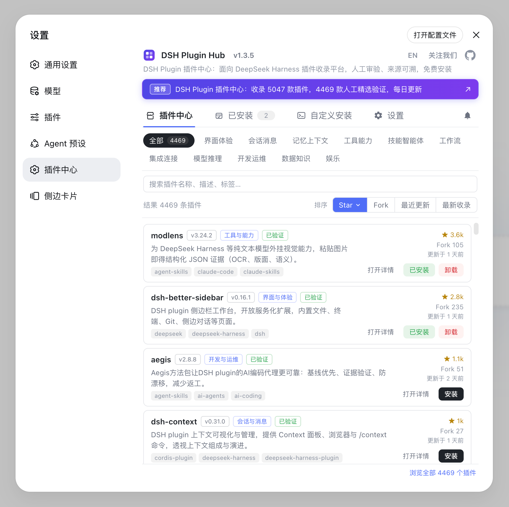
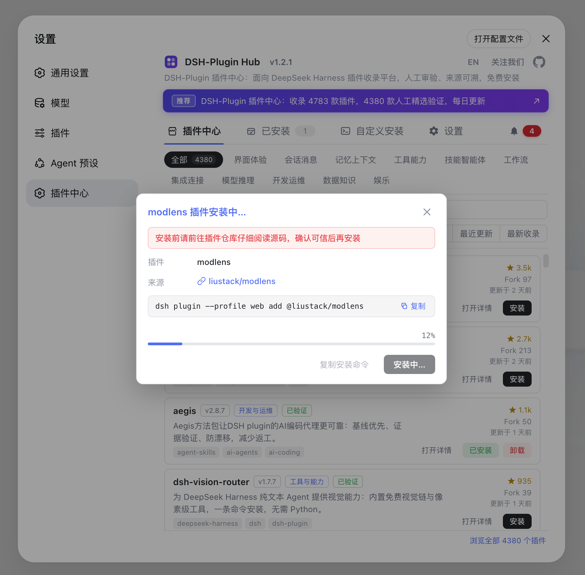
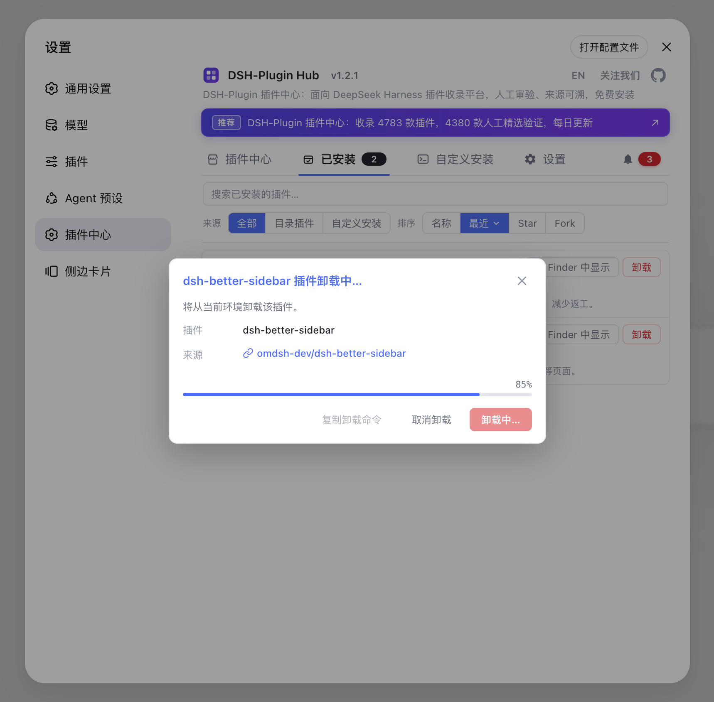
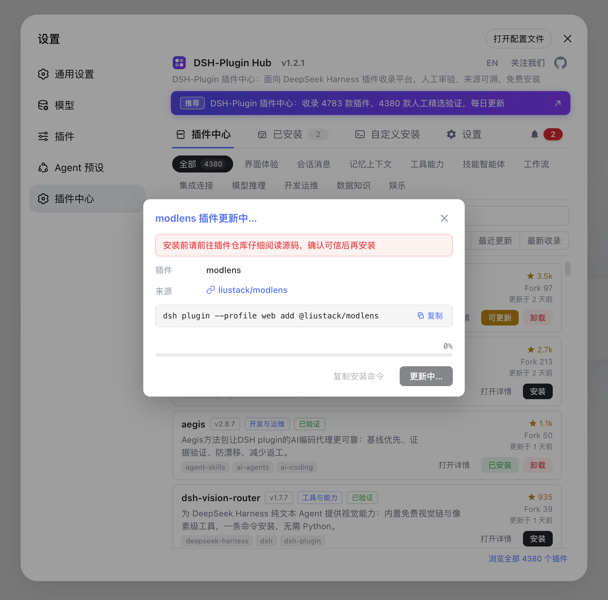
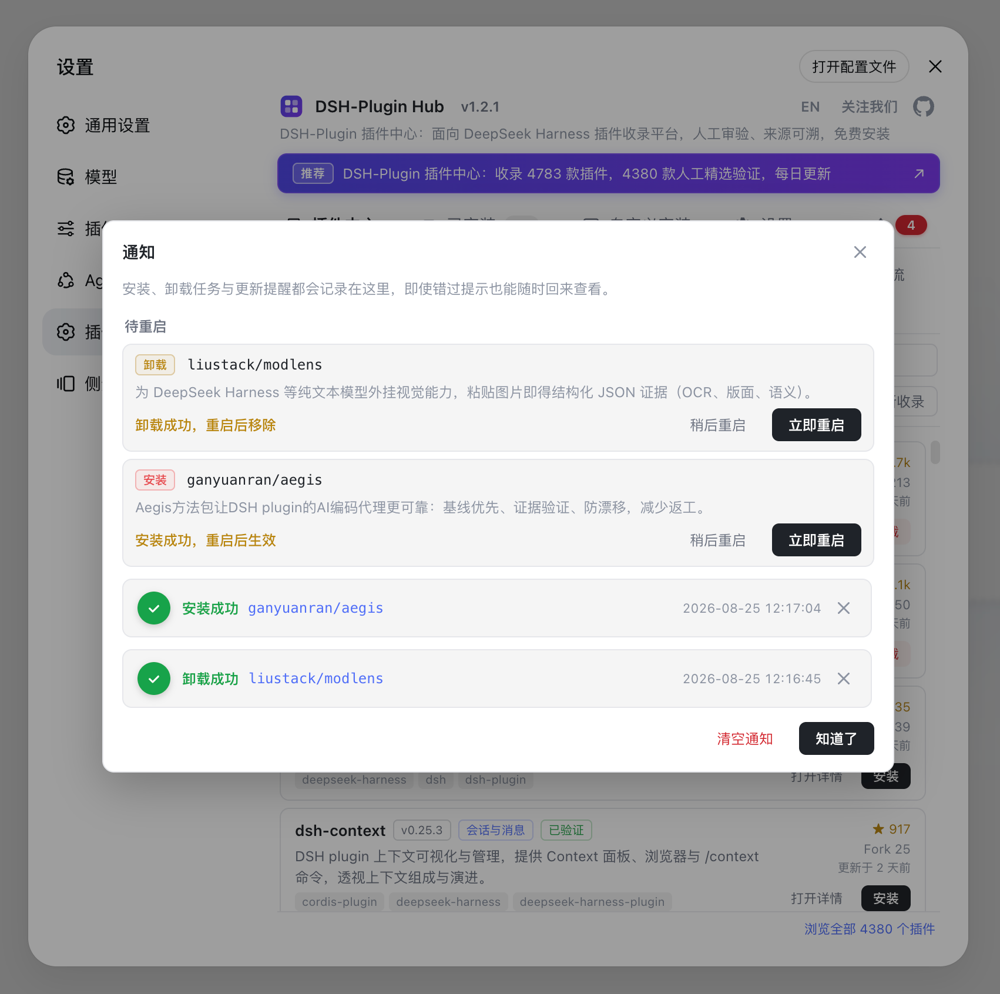
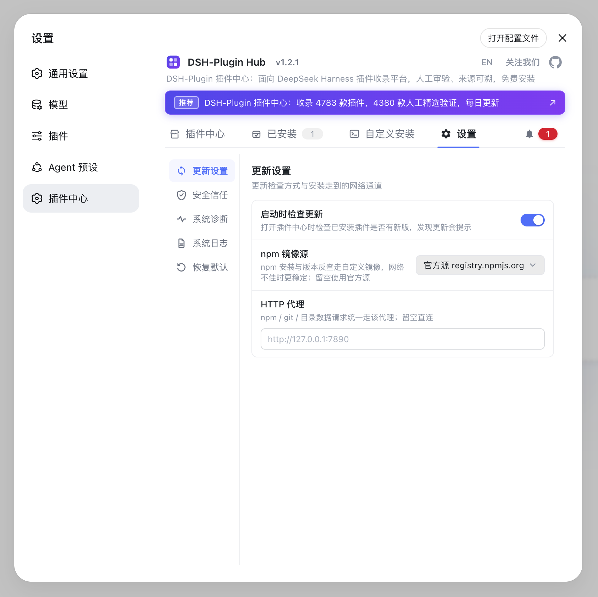
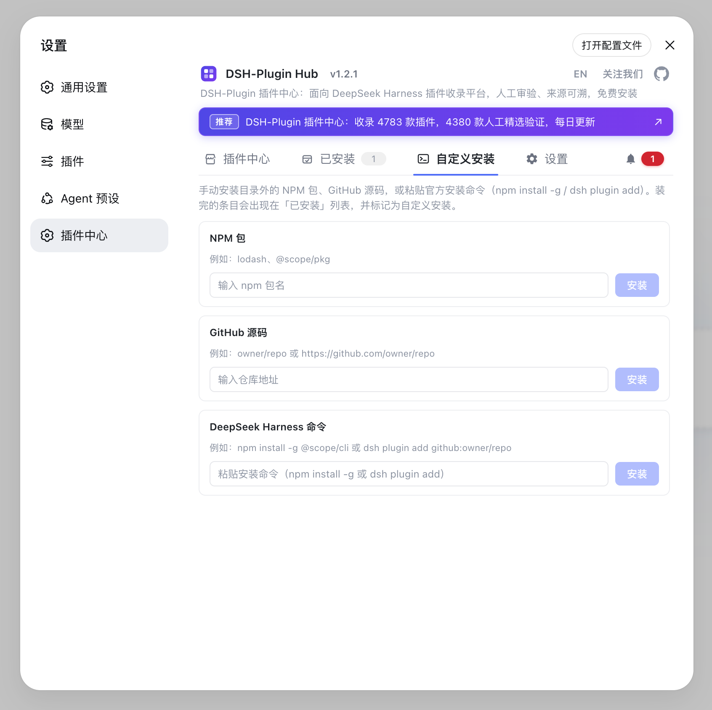
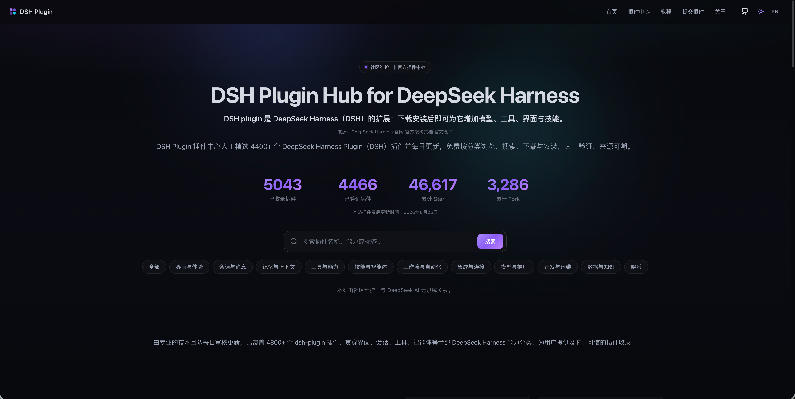
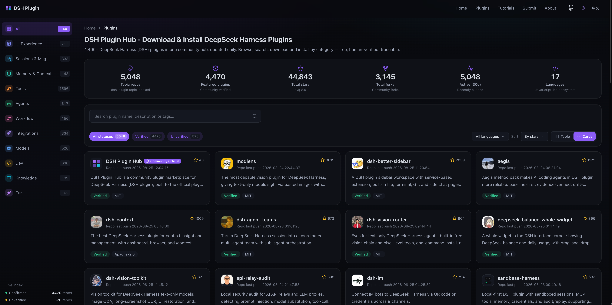

<div align="center">

<p>
  
</p>

# DSH Plugin 插件中心 - DeepSeek Harness Plugin (DSH) 下载与安装 · 插件大全

**DeepSeek Harness 社区插件市场：收录 5,048 个 DSH plugin，人工精选验证 4,470**

[](LICENSE)
[](https://www.npmjs.com/package/dsh-plugin)
[](https://github.com/dshplugin/dsh-plugin-hub/actions)
[](https://dsh-plugin.org/plugins/dshplugin/dsh-plugin-hub)
[](https://github.com/dshplugin/dsh-plugin-hub)
[](https://dsh-plugin.org)
[](https://github.com/topics/dsh-plugin)

[官网](https://dsh-plugin.org) · [提交 Issue](https://github.com/dshplugin/dsh-plugin-hub/issues) · [提交插件](https://dsh-plugin.org/zh/submit)

**简体中文** · [English](README.en.md)

</div>

---

## 什么是 DSH-Plugin Hub

DSH-Plugin Hub 是 **DeepSeek Harness 社区插件市场**：一个遵循官方插件开发规范构建的开源插件，安装进「设置 → 插件中心」后，无需离开应用即可浏览、搜索并一键安装社区插件。本项目为独立社区项目，与 DeepSeek Harness 官方无隶属关系。

<p align="center">
  
</p>

## 插件中心特性

**一键操作 · 全部可视化**

- **一键安装** — 点击即装：后台队列串行执行，弹窗实时显示安装进度，可随时取消；装完刷新页面即生效，无需重启
- **一键升级** — 目录检测到新版本自动提示，卡片按钮变为「更新」，覆盖安装一键完成
- **一键卸载** — 卸载全程可视化，实时进度一目了然，卸载成功即生效
- **任务留痕** — 每次安装 / 升级 / 卸载的成功与失败都会写入通知中心，随时回查

**通知中心**

- 进行中任务的实时进度与取消、待重启项、成功 / 失败历史记录集中管理
- 失败可一键提交 GitHub Issue，为开源做贡献；待重启项支持「稍后重启 / 立即重启」

**资源丰富 · 人工精选**

- 收录 **5,048** 个社区插件，其中 **4,470** 已人工精选验证，由 [dsh-plugin.org](https://dsh-plugin.org) 每日收录、人工审核并发布
- 涵盖界面与体验、会话与消息、记忆与上下文、工具能力等分类，按分类浏览、搜索直达
- 每个插件标注人工验证状态（verified）、Star / Fork 评分、版本号与最近更新时间，来源可溯

**中英双语 · 直观筛选**

- 界面默认跟随系统语言，右上角一键手动切换，界面文案与插件数据同步切换
- 支持「最热 / 最新 / 最早收录」排序，双语描述、能力标签一目了然
- 按已安装 / 未安装快速过滤，配合全文搜索精确定位目标插件

**实时同步 · 轻量安全**

- 数据与官网同源，安装后自动获取最新目录，无需手动升级
- 仅浏览器端注入，无宿主服务依赖，无遥测、无隐私采集

## 功能一览

| 一键安装 | 一键卸载 |
| :---: | :---: |
|  |  |
| 后台队列串行执行，弹窗实时显示安装进度，可随时取消 | 卸载全程可视化，实时进度一目了然，成功即生效 |

| 一键更新 | 通知中心 |
| :---: | :---: |
|  |  |
| 检测到新版本自动提示「更新」，一键覆盖安装完成升级 | 进行中任务、待重启项与成功/失败历史集中管理，失败可一键提交 Issue |

| 设置 | 自定义安装 |
| :---: | :---: |
|  |  |
| 启动时检查更新、NPM 镜像源与代理通道、命令行安装安全开关与日志存放位置集中管理 | 手动安装目录外的 NPM 包或 GitHub 源码，粘贴官方安装命令即可装任意插件，装完标记「自定义安装」 |

## 官网一览

插件中心的数据由 [dsh-plugin.org](https://dsh-plugin.org) 整理发布，两侧实时同步；在官网还可以查看插件详情、评分与 GitHub 源码链接。

| 官网首页 | 分类展示 |
| :---: | :---: |
|  |  |
| 数据与插件中心同源，人工精选验证、每日更新 | 按分类浏览全部收录插件，支持搜索直达 |

## 为什么选择 DSH-Plugin Hub

DSH-Plugin 插件中心收录 **5,048** 个 DeepSeek Harness Plugin（DSH）插件，其中 **4,470** 已人工精选验证，每日更新，免费按分类浏览、搜索、下载与安装，来源可溯。

### 及时更新

新发布的 DSH plugin 会尽快收录进插件中心，已有插件的描述、分类与兼容状态也会定期刷新。专业团队持续跟进 DeepSeek Harness 生态动态，让你始终看到最新信息。

### 人工审核

每个 DSH plugin 都由专业的技术团队人工核查，逐项核对安装命令、兼容状态（verified / unconfirmed）与 DSH 目标版本（dshTarget），并标注能力分类，质量有保障。

### 来源可查

每个 DSH plugin 都链回其 GitHub 源码仓库，并展示 Star、Fork 与最近更新时间；本站数据整理自 DeepSeek Harness 官网、官方架构文档与官方仓库，看到的信息都有据可查。

## 安装 DSH-Plugin Hub

从 npm 安装（推荐）：

```bash
dsh plugin --profile web add dsh-plugin
```

插件已发布到 npm registry（包名 `dsh-plugin`），一条命令即可安装使用，无需任何构建。

从 GitHub 安装：

```bash
dsh plugin --profile web add git+https://github.com/dshplugin/dsh-plugin-hub.git
```

> **提示**：插件已内置浏览器端 bundle，从 GitHub 安装无需任何构建与授权；装完重启 `dsh web`，在「设置 → 插件中心」即可使用。

## 快速开始：在 DeepSeek Harness 中使用

安装完成后重启 `dsh web`，打开 **设置 → 插件中心**，即可浏览并安装插件。插件市场与 [dsh-plugin.org](https://dsh-plugin.org) 官网数据同源、实时同步。

## 提交你的 DSH plugin

将你的插件发布到 GitHub 并添加 `dsh-plugin` topic，即可被 DSH-Plugin 插件目录自动发现与收录。收录要求与提交流程见官网[提交插件](https://dsh-plugin.org/zh/submit)页面。

## 贡献

- **收录你的插件**：添加 `dsh-plugin` topic 即可被自动发现，入口见官网[提交插件](https://dsh-plugin.org/zh/submit)
- **数据勘误 / 功能建议**：欢迎[提交 Issue](https://github.com/dshplugin/dsh-plugin-hub/issues)
- **参与开发**：Fork 本仓库并提交 Pull Request

## 相关项目

- [dsh-plugin.org](https://dsh-plugin.org) — 插件中心官网，数据同源
- [deepseek-ai/deepseek-harness](https://github.com/deepseek-ai/deepseek-harness) — DeepSeek Harness 本体

## 许可

[MIT](LICENSE) © DSH-Plugin Hub contributors
